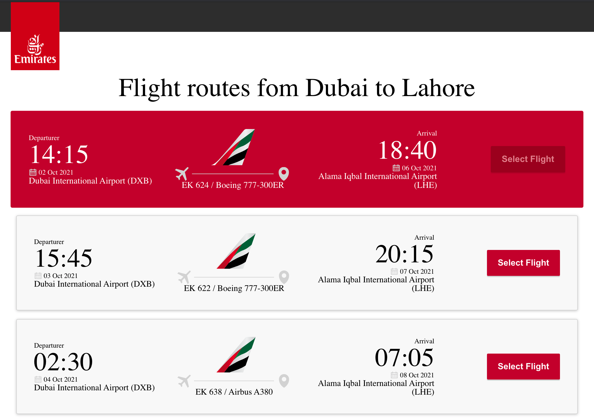

<h1 align="center">Emirates Case Study</h1>

 Please access live site [Emirates Case Study](https://furqanfreed.github.io/emirates-case-study/).


## `Dev Setup & Scirpts`
NodeJS is require to run project. make sure node is installed. In the project directory, you can run:
- npm install
- npm start
- npm test


## `Run Test`
In the project directory, you can run:

    `npm test`

## `API Data`
The data is used from a Mocked API Response as a JSON object (random data) which can be found in public dierctory in ```flights.json``` file.

### `npm start`

Runs the app in the development mode.\
Open [http://localhost:3000](http://localhost:3000) to view it in the browser.



